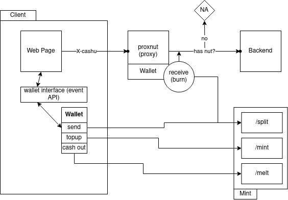

# Proxnut: a cashu proxy that asks for nuts for a right of passage

This is a work in progress. It does not work yet (presumably because of incompatibility issues between deno and cashu-ts)

How it works

